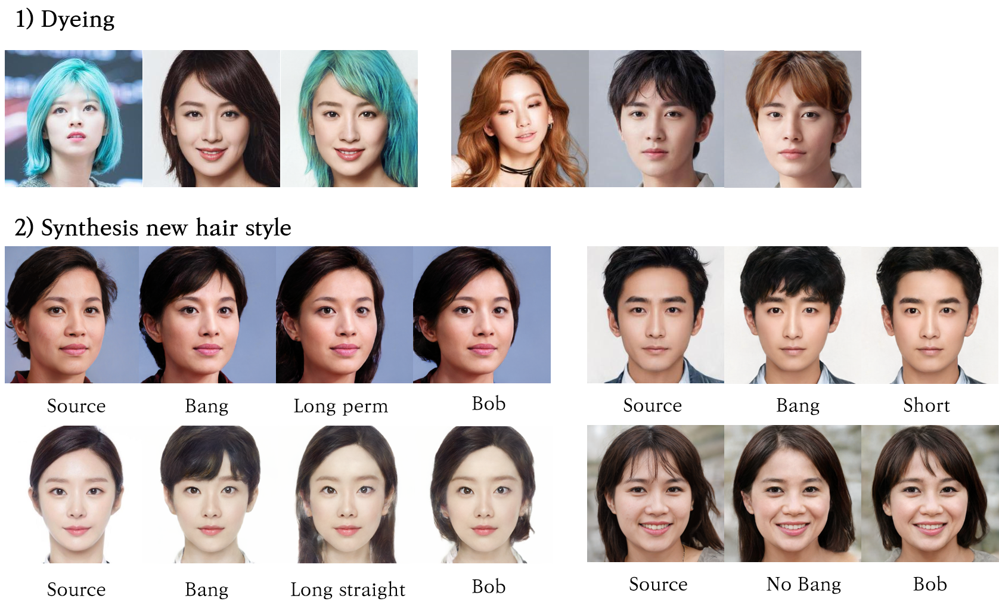
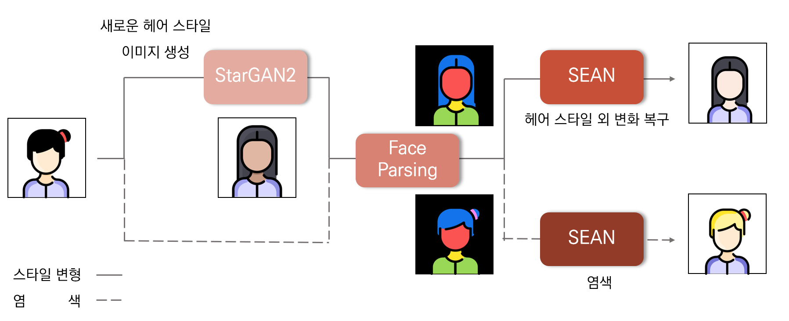

# Hair-synthesis-using-GAN, 꽤 GAN찮은 헤어살롱

## #들어가기에 앞서
이 프로젝트는 제 12회 빅데이터 연합동아리 BOAZ 컨퍼런스를 위해 진행한 것으로, 자세한 내용은 [발표 자료]()와 [영상](), [프로젝트 회고 글]()에서 확인하실 수 있습니다. (0801 기준, 추후 링크 게시 예정)

## #프로젝트 소개
GAN 기반의 모델(StarGAN-v2)을 활용해 댜앙한 헤어 스타일의 사람 이미지를 학습하고, 학습한 헤어 스타일을 가진 이미지를 생성하는 프로젝트입니다. GAN 모델을 거치면서 헤어 스타일 외의 피부톤, 화장등과 같은 다른 특징이 변화한다는 점을 해결하기 위해, Segmentation map 기반의 GAN 모델(SEAN)을 추가적으로 사용하였습니다. 

## #전체 프로세스

모델을 통해 가능한 헤어 스타일 변화는 1)염색과 2)헤어 스타일 적용 크게 두가지로 나뉩니다. 

### 1)염색
염색은 SEAN 모델만을 거칩니다. 원하는 머리색을 가진 사람의 이미지와 해당 이미지의 segmentation map, Src 이미지(= 헤어 스타일을 바꾸고 싶은 사람의 이미지)와 해당 이미지의 segmentation map을 SEAN 모델의 인풋으로 사용합니다. 이 때 이미지의 segmentation map은 BiSeNet 기반의 Face parsing 모델을 통해 얻습니다.

### 2)헤어 스타일 적용
먼저, Src 이미지는 학습된 StarGAN-v2 모델을 거칩니다. 앞머리 만들기(Bang), 앞머리 없애기(No_Bang), 긴 생머리(Long_straight), 롱펌(Long_perm), 단발머리(Bob), 숏컷(Short), 금발(Blond), 총 7개의 도메인으로 Src 이미지를 변환할 수 있습니다. 이미지 변환 방식에는 1)Reference 이미지의 스타일을 가져오는 방식과, 2)랜덤 벡터를 특정 도메인의 스타일 벡터로 맵핑해 이미지를 생성하는 방식이 있습니다. 

이렇게 새롭게 생성된 이미지와 해당 이미지의 segmentation map, Src 이미지와 해당 이미지의 segmentation map을 SEAN 모델의 인풋으로 사용하게 됩니다.

## #References
- [StarGAN-v2](https://github.com/clovaai/stargan-v2)
- [SEAN](https://github.com/ZPdesu/SEAN)
- [CBAM_PyTorch](https://github.com/luuuyi/CBAM.PyTorch)
- [face-parsing.PyTorch](https://github.com/zllrunning/face-parsing.PyTorch)
